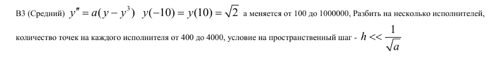

# Boundary value problem

Problem statement (as all good problem statements it's in Russian):

To solve system using reduction method,
system should have size: 2^p + 1

Firsly, I linearize system using Newton's linearization.

Secondly, I make this system descrete: project continious functions to descrete grid
using Numerov's approximation

Thirdly, I solve this system using reduction method:

    a. Compute reduction coeffictients
    b. Invert reduction and compute 'y' values
