# Boundary value problem

Problem statement (as all good problem statements it's in Russian):

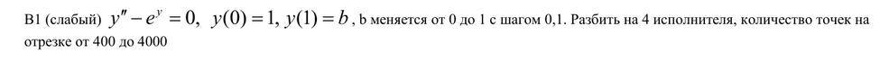

To solve system using reduction method,
system should have size: 2^p + 1

Firsly, I linearized system using Newton's linearization.
Check: [Article about Newton's linearization](https://studfile.net/preview/2465136/page:4/)

Secondly, I make this system descrete: project continious functions to descrete grid
using Numerov's approximation.
Check: [Article about Numerov's method](https://en.wikipedia.org/wiki/Numerov%27s_method)

Now we have tridiagonal linear eq system, that look like:
$a_{n} * y_{n-1} + b_{n} * y_{n} + c_{n} * y_{n+1} = d_{n}$

Such systems can be solved with progonla algo (tridiagonal matrxi algo), but it's poorly parallelizable.

To overcome it I apply reduction algo. If we look at chunk of our linear system:

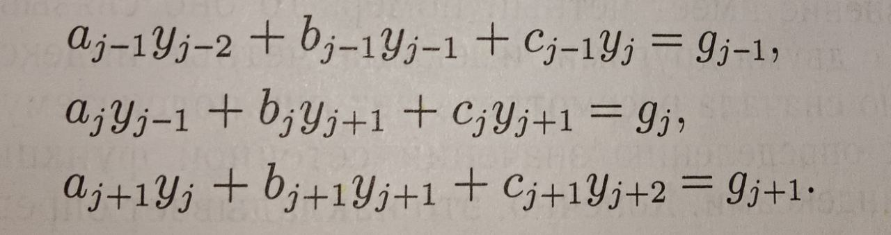

We can add 1st and 3rd equation to the 2nd one and get new one.
But that equation now connect $y_{j+2}$ and $y_{j}$ and $y_{j+2}$.

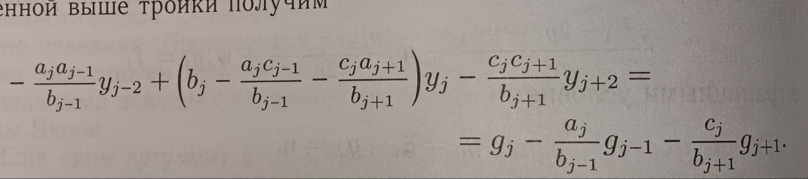

We get new system only on odd equations. It is half size of initial one.
To this new system on odd equations we can apply the same technique.

By applying this technique recursively we would get single equation that connects:
$y_{0}$, $y_{N/2}$ and $y_{N}$. As $y_{0}$ and $y_{N}$ are boundary conditions and are known.

So we can find $y_{N/2}$. Thus we divided the whole boundary value problem linear system on 2 systems of half size. 1st system consists of equations from 0 to N/2, 2nd - from N/2 to N. As values at 0, N/2 and N are known we can consider these systems as independent boundary value problems.

Then we can inverse reduction one more time and get 4 systems at all.
Or we can solve these 2 systems directly using progonka method.

It depends on number of cores that we want distribute task to.

I tried solving the whole system using inverse traverse of reduction.
But error in this method is accumulated very rapidly.
So it works bad for stiff problems.
It's recommended to use progonka algorith, form some step as
its error accumulation properties are better.

So thirdly, I solve this system:

    a. Sequentially compute reduction coeffictients
    b. Invert reduction and get smaller systems
    c. Solve smaller system using progonka (tridiagonal matrxi algo)

Results:

Initial statistics:

```
        [TIME] total: 4.934359 ms
fill coefs for Numerov's method: 57.7%
Forward reduction: 9.4%
Inverse reduction + Progonka: 30.3%
Update rough solution (check Newton's linerarization for detatils): 2.5%
N = 32769, h = 0.000031
```

I tried parallelizing with std::thread inverse reduction part.
There is benefit, but it's relatively small as bottleneck is "fill coefs" part

So I parallized coefficients filling using std::thread.
Also I decreased number of calls for g() and s() functions by
keeping array to cache return values.
As it was bottleneck, benefit from such decision is significant.
I measured perfomance for 1, 2, 4 and 8 threads.

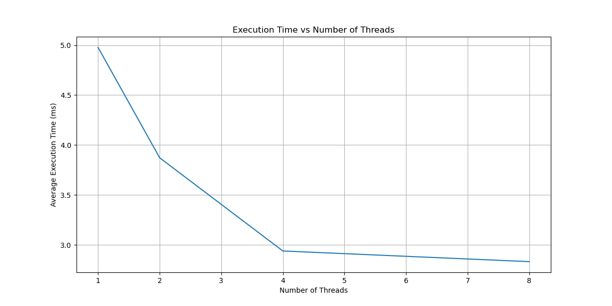

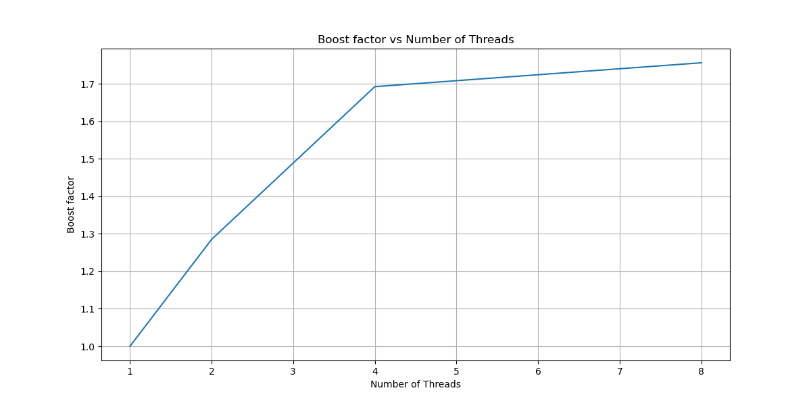

Plot of solutions:

For 1B:

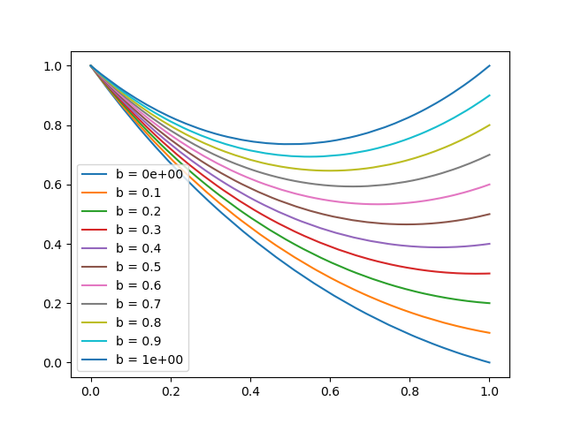

For 2B:

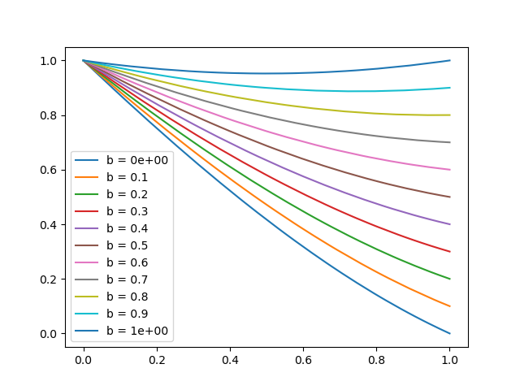

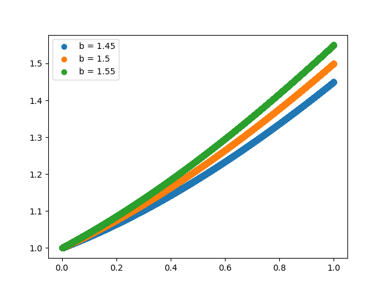

For B3:

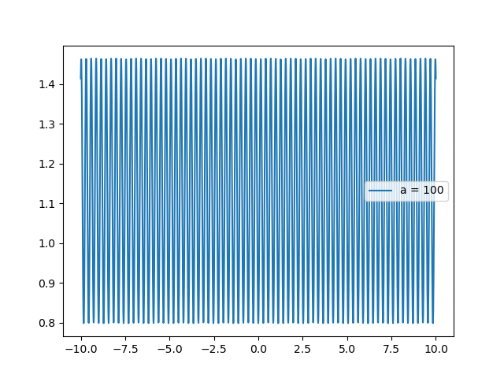

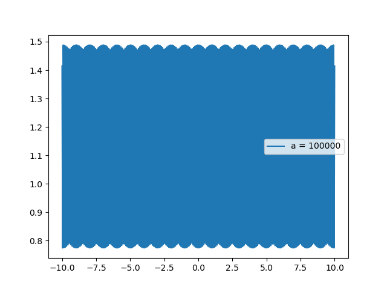

For B4:

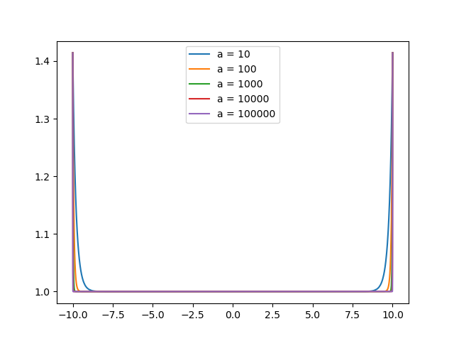
