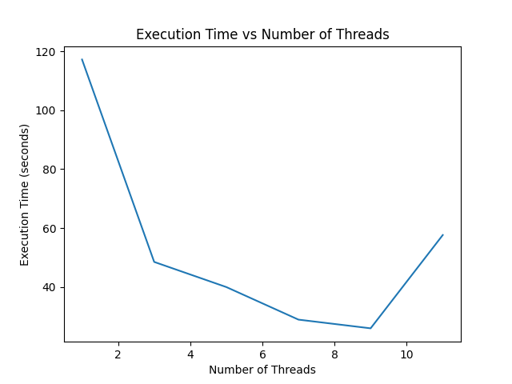

Introductory tasks for OpenMP:

1. [Hello](./bonjour.cpp): every thread prints hello and thread id

```
$ make FILE=bonjour
$ ./a.out
```

2. [Summation](./sum.cpp): parallel summation of $\sum{\frac{1}{n}}$


```
$ make FILE=sum
$ ./a.out
```

Sum is divided into sections. Each section's sum is computed. Then
master thread gathers these result.

2.1 Summation result depends on order of summation. If master thread does gathering from the first section we get less accurate result due to variable float precision. Conceptually it works like:

Sum from 1st section:
((1. +  0.001) + 0.009) = 1

Sum from last section:
(1. + (0.001 + 0.009)) = 1.01

2.2 I tried computing sum with different number of threads:


N = 10 millions in this experiment.

We see that with 9 threads the best result is reached. Making more threads introduces extra cost that neglects benefit of parallelizing task.

3. [Sequential access](./access.cpp): sum thread ids in sequantial manner via shared variable


```
$ make FILE=access
$ ./a.out
```


Implemented via busy wait

** EXTRA **

[Script to launch app with varyinng amount of threads](./launcher.sh)
[Plot results of previous scriot](./plotter.py): it needs matplotlib to be installed