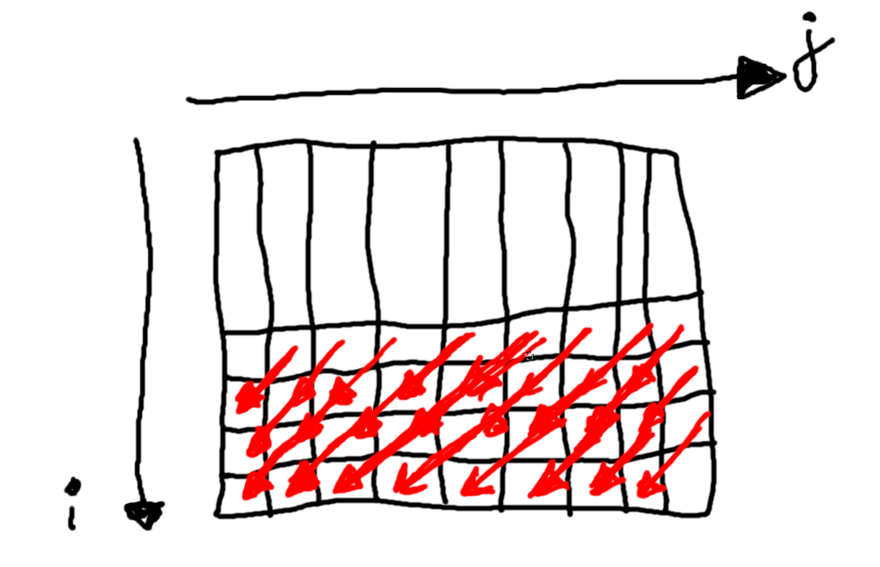

# Parallelize loop

In this project I parallelize 3 nested 'for' loops using OpenMP and MPI.

## Loop #1

```cpp
for (i=1; i<ISIZE; i++){
    for (j = 0; j < JSIZE-1; j++){
        a[i][j] = sin(2*a[i-1][j+1]);
    }
}
```

Let's look at this task closer.
Dependency vector looks like: [-1 +1]


So we have diagonal dependency:


If we draw this dependency for several cells, like this:



We would understand that for concrete 'i' we can easily do 'j' job in parallel.
But we need to wait while previos 'i' row is complete.

To paralellize this loop in this way with OpenMPI we need:
1. Create program that will be executed on each execution unit
2. Distribute work between units
3. Do the work
4. Wait while units from previous row complete job.

I start JSIZE executors to execute all columns in parallel.
