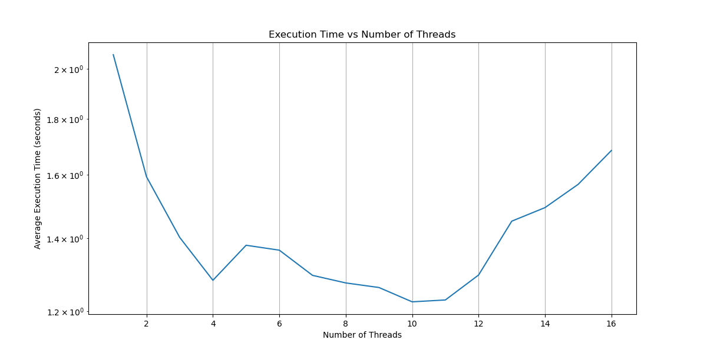
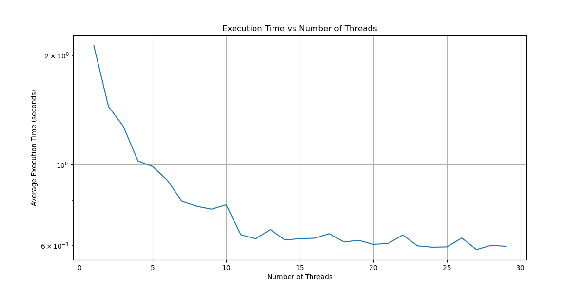
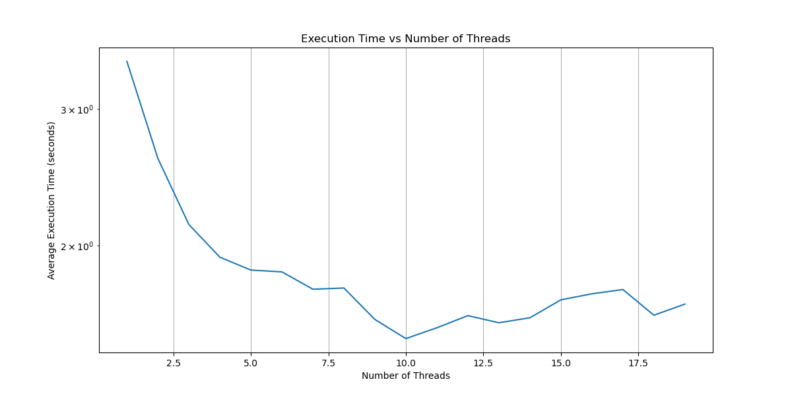

# Parallelize loop

In this project I parallelize 3 nested 'for' loops using OpenMP and MPI.

## Loop #1

```cpp
for (i=1; i<ISIZE; i++){
    for (j = 0; j < JSIZE-1; j++){
        a[i][j] = sin(2*a[i-1][j+1]);
    }
}
```

Dependency vector looks like: [-1, +1]
That dependency is diagonal.
So we at least can parallelize for 'j'.

I parallalized by 'j' and did benchmarking.
ISIZE = JSIZE = 10'000.



## Loop #2

```cpp
for (i=0; i<ISIZE-1; i++){
    for (j = 6; j < JSIZE; j++){
        a[i][j] = sin(0.2*a[i+1][j-6]);
    }
}
```

There is dependency only from initial values.

So to do the parallelization we just need to make copy of
initial values to avoid write-after-read hazard. 



If we increase number of threads **perfomance decreases very slowly**.
If OMP_NUM_THREADS is 16400 then execution time is abouy 1 sec.

It contrasts with 1a, where perfomance started decreasing when thread number exceeded hardware thread number.

I guess it's because in 1a there was interthread communication and with increasing threadnumber we would
increase this communications number.

Biut here we do pure parallezation without any communication.

## Loop #3

```cpp
for (i=0; i<ISIZE; i++){
    for (j = 0; j < JSIZE; j++){
        a[i][j] = sin(0.01*a[i][j]);
    }
}

for (i=0; i<ISIZE; i++){
    for (j = 2; j < JSIZE; j++){
        b[i][j] = a[i][j-2]*2.5;
    }
}
```

We see that there is no inter-iteration dependencies.
Only from initial data.



But we see that with increasing number of threads,
execution time start increasing.

It contrasts with 2b.

Why? Because OpenMP and OpenMPI are created for different purposes.
OpenMP works by using shared memory. On the other side OpenMPI uses
distributed memory model.

So to complete our task in OpenMPI system we need to gather data in the end.
And time spent on gathering this data depends on number of threads.


In OpenMP we didn't need to do this operation as we work on shared memory.
Every executor only changes its part of shared memory.

