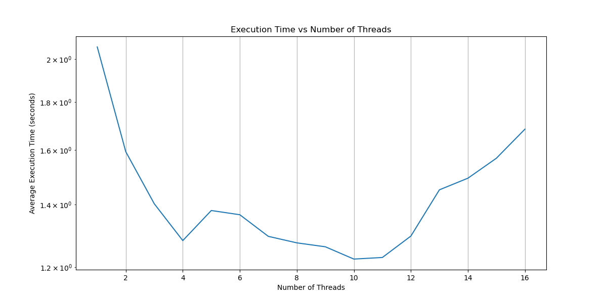

# Parallelize loop

In this project I parallelize 3 nested 'for' loops using OpenMP and MPI.

## Loop #1

```cpp
for (i=1; i<ISIZE; i++){
    for (j = 0; j < JSIZE-1; j++){
        a[i][j] = sin(2*a[i-1][j+1]);
    }
}
```

Dependency vector looks like: [-1, +1]
That dependency is diagonal.
So we at least can parallelize for 'j'.

I parallalized by 'j' and did benchmarking.
ISIZE = JSIZE = 10'000.



## Loop #2

```cpp
for (i=0; i<ISIZE-1; i++){
    for (j = 6; j < JSIZE; j++){
        a[i][j] = sin(0.2*a[i+1][j-6]);
    }
}
```
